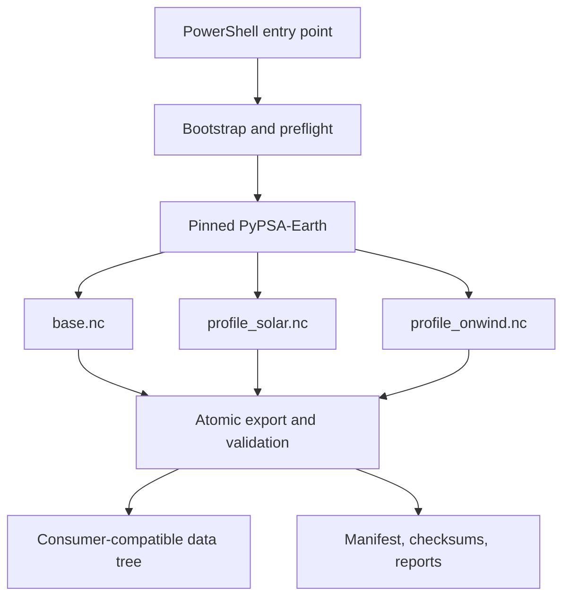
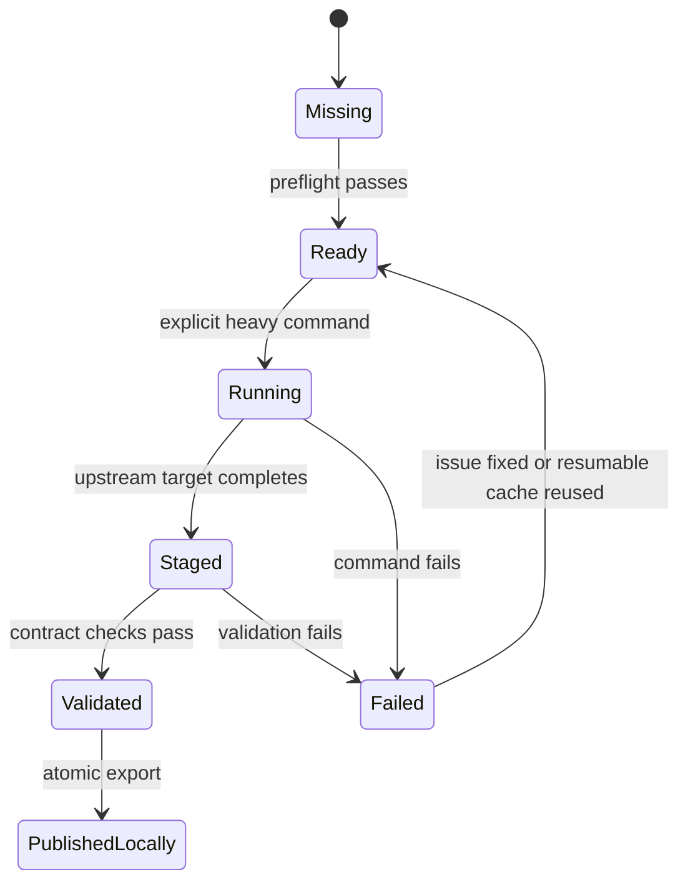

# Architecture

## Boundary

The project is an orchestration and reproducibility layer around a pinned
PyPSA-Earth checkout. It does not fork the scientific workflow and does not absorb
Ecuador-specific model processing.



## Planned repository layout

```text
EcuadorElectricGridData/
├── AGENTS.md
├── README.md
├── config.yaml
├── environment.yml
├── run.ps1
├── config/
│   ├── legacy_pypsa_earth.yaml
│   └── pypsa_earth.yaml
├── src/ecuador_grid_data/
│   ├── cli.py
│   ├── bootstrap.py
│   ├── preflight.py
│   ├── upstream.py
│   ├── stages.py
│   ├── export.py
│   ├── validation.py
│   └── provenance.py
├── tests/
│   └── fixtures/
├── docs/
├── reports/
│   └── figures/
├── .vendor/                 # ignored
├── .venv/                   # ignored
├── data/                    # generated and ignored
│   ├── downloads/
│   ├── work/
│   ├── raw/
│   └── provenance/
└── artifacts/               # release packages, ignored
```

The initial commit intentionally contains only project guidance and configuration;
implementation directories appear in their phase.

## Components

### PowerShell entry point

`run.ps1` is the stable Windows interface. It must remain thin: discover the project
root, acquire or invoke the environment manager, ensure the local environment, and
dispatch to the Python CLI. Scientific logic does not belong in PowerShell.

### Bootstrap and environment

The bootstrap owns `.tools/`, `.venv/`, and `.vendor/`. Tool downloads must be pinned
and checksummed. PyPSA-Earth must be checked out at the configured full SHA. A dirty
vendor checkout or SHA mismatch is an error unless a clearly named development
override is provided.

### Python orchestration

The Python layer resolves configuration, constructs stage plans, performs preflight,
runs upstream commands, streams output, tracks state, exports artifacts, validates
results, and writes provenance. It should not reproduce PyPSA-Earth algorithms.

### Upstream workspace

PyPSA-Earth works inside `.vendor/pypsa-earth` with a generated effective
configuration. Upstream-produced files remain in its workspace until validated. A
stage-specific state record links upstream paths to exported consumer paths.

### Export layer

Exports use a same-volume temporary file when possible:

1. verify the upstream file is complete and readable;
2. copy to a temporary destination;
3. compute checksum and run contract validation;
4. atomically replace the final path;
5. write provenance.

Existing final files require confirmation unless `--force` was supplied explicitly.

### Validation layer

Structural checks are fast and deterministic. Scientific checks may create report
figures but must never mutate source artifacts. Validation results are machine-readable
and summarized in the phase report.

### Provenance layer

Each artifact manifest records:

- artifact name, size, SHA-256, and creation time;
- this repository commit and dirty status;
- PyPSA-Earth commit and dirty status;
- environment lock/export hash;
- effective configuration hash and embedded copy;
- source/bundle identifiers and checksums;
- exact command and stage timings;
- validation version and results;
- platform and relevant hardware information.

## State transitions



A file is authoritative only in `PublishedLocally`. Presence alone is not success.

## Failure model

Subprocess return codes, missing files, validation failures, checksum mismatches, and
unexpected upstream state are fatal. The CLI must print the failed stage, log path,
last useful upstream message, preserved cache/state, and exact rerun command.
